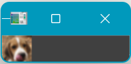

对于图像金字塔的理解：

>  图像金字塔则是图像多尺度调整表达的一种重要的方式，图像金字塔方法的原理是：将参加融合的的每幅图像分解为多尺度的金字塔图像序列，将低分辨率的图像在上层，高分辨率的图像在下层。

> 高斯金字塔用来向下降采样图像：
>
> > 降采样其实是由金字塔底部向上采样，分辨率降低

> 拉普拉斯金字塔用来从金字塔底层图像中向上采样重建一个图像。
>
> > 从金字塔低层图像重建上层未采样图像，在数字图像处理中也即是预测残差，可以对图像进行最大程度的还原

> 所谓上下采样是指对图像的尺寸而言的，向上就是图像尺寸加倍，向下就是图像尺寸减半。不是指金字塔。

## 高斯金字塔

> 通过高斯平滑和亚采样获得一系列下采样图像

==**对于图像的下取样操作：**==

> 1.高斯模糊
>
> 2.去除所有偶数行列

> 结果图像只有原图的四分之一。通过对输入图像不停迭代以上步骤就会得到整个金字塔。向下取样会逐渐丢失图像的信息。

用opencv实现下采样：

```python
lower = cv2.pyrDown(higher)
```

演示代码：

```python
img = cv2.imread("E:/DeskTop/photo/dog2.jpg")  
for i in range(5):
    img = cv2.pyrDown(img)
    cv2.imshow("original",img)
    cv2.waitKey()
    cv2.destroyAllWindows()
```

下面是部分截图：




==**对于图像的上采样操作：**==

> 图像尺寸的放大

> 1.将图像在每个方向扩大为原来的两倍，新增的行和列以0填充
>
> 2.使用先前同样的内核(乘以4)与放大后的图像卷积，获得 “新增像素”的近似值

OPENCV实现：

```python
higher = cv2.pyrUp(lower)
```

演示代码：

```python
img = cv2.imread("E:/DeskTop/photo/dog2.jpg")
for i in range(5):
    img = cv2.pyrUp(img)
    cv2.imshow("original",img)
    cv2.waitKey()
    cv2.destroyAllWindows()
```


