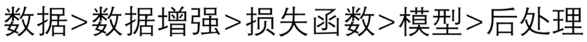

## 从数据层面优化

> 预计第一阶段线上资格赛的评判标准主要应该是对于模型优化程度的比较

### 数据集均衡化

> 例如数据集的大部分目标位置都是位于中间的位置。
>
> 可以通过适当的截取以及分割，保留图像的目标核心，使得模型学习更加专注，并且在一定程度上改变位置。

### 数据增强

> 数据增强对于模型训练会是一个较为有效的手段
>
> 需要关注的是，根据具体任务来选择数据增强的手段

==**对于有想法的数据增强手段,通过实验性的训练模型（简单的跑若干个epoch即可）来观察是最好的验证手段**==

> paddleseg 的 Rich Crop 数据增强策略可以考虑使用

## 从训练角度优化

### 模型选择

根据 推理时间图 以及 参数量图 来选择<高交并比，短推理速度>的模型

并不是所有的模型都需要尝试，有限度的选择较优的。

> 有时间可以考虑阅读模型的论文，深入理解其优化思想

### 模型优化的思路

1.深度层面

2.多宽度多尺度

3.残差连接，更快的的收敛

### 超参数优化

1.考虑优化器的种类

2.学习率的调整

3.数据增强方法的选择

> 在实验总部需要关注控制变量，并且做好记录

### 损失函数

> 考虑在基准的损失函数上添加一些辅助的损失函数
>
> 效果需要测试，不一定有效

## 从模型角度优化

> 数据集中可能存在一些被污染或者是有标注错误的数据集，这里给出了一个测试手段：
>
> 正常的训练模型，在测试阶段，令batchsize为  1 ，一张一张的输入， 然后得到一组评价指标 ，明显离群的数据（加个遍历判据）可以取出单独分析。
>
> 标注错误就手动校正，模型学习有问题再具体分析优化

### 测试时增强

> 在推理时，给模型展示多个经过随机变化的图像，结果取其平均
>
> 时间换精度，根据任务考虑，不一定有效
>
> 项目地址：
>
> https://girhub.com/AgentMaker/PaTTA

## 打榜技巧

### 量化实现性能优化

> 读取图像时，把数据的精度降低，可以获得更快的推理速度

> 此处是在推理时的使用，训练依然使用正常的数据精度

> 下面是模型性能的三种优化手段：
>
> 量化是减小数据的空间从而减少计算量
>
> 模型剪枝以及蒸馏较为复杂，后面找机会详细学习

### 综合优化建议

> 先考虑前序的数据优化策略，最后再尝试模型优化

