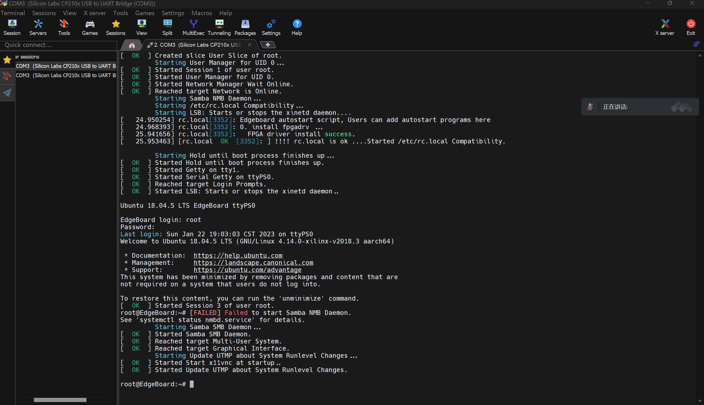

# 日志

1.学习opencv

2.收到SD卡，接线配置edgeboard。

3.学习linux的常用指令，在edgeboard实践学习。

# 学习总结

## 使用串口连接

详细流程参考：

> 说明文档/EdgeBoard计算卡（FZ3B赛事定制版）说明文档1.26/04常见操作和工具/**FZ3B可视化访问的方法说明.pdf**

安装终端模拟软件mobaxterm以及usb转串口驱动 CP210x_Windows_Drivers：

> CP210x_Windows_Drivers下载地址：
>
> https://cn.silabs.com/developers/usb-to-uart-bridge-vcp-drivers
>
> mobaxterm下载地址：
>
> https://mobaxterm.mobatek.net/download.html

系统用户名为：root

密码为：root



## 连接显示屏

需要两个连接线：

>  主动式 miniDP 转 HDMI 转接线
>
>  USB接线

接入后屏幕显示：

> 必须在启动前插上显示器，否则在系统启动后再插上显示器，不会显示


## ls 列举当前目录下的文件

list-列举当前目录下的文件


## cd 切换文件路径

 Change Directory-切换文件路径


##  mkdir 新建一个新目录

Make Directory-新建一个新目录


## pwd 显示当前目录的绝对路径

 Print Working Directory-显示当前目录的绝对路径


## rm 删除给定的文件

 Remove-删除给定的文件

包含三种用法：

> 删除文件 rm [文件名]
>
> 删除文件夹及其子文件 rm -rf [文件夹名]
>
> 删除当前目录下的所有文件 和文件夹 rm -rf *

## mv 移动文件或修改文件名称

 Move-移动文件或修改文件名称

包含两种用法：

> 移动A文件或文件夹到B文件夹下 mv [A文件名] [B文件夹名] 
>
> 将A文件重命名为C文 件 mv [A文件名] [C文件名]

## cp 对文件进行复制

 Copy-对文件进行复制

包含两种用法：

> 复制文件A到文件夹B中 copy [A文件名] [B文件夹名]
>
> 复制文件夹C到文件夹B 中 copy -r [C文件夹名] [B文件夹名]


## cat 查看文件内容

concatenate and print files-查看文件内容

>  cat [文件名]

## tar 压缩文件

用法：

> 压缩文件为tar.gz文件 ：
>
> tar -zcvf [test.tar(压缩后文件名)].gz [test(欲压缩的文件名)] 
>
> 解压文件：
>
> tar -zxvf [test（解压文件名）].tar.gz

## unzip 解压zip格式的压缩文件

 unzip [目标zip]


## vim 文本编辑器

包含三种模式：是命令模式（Command mode），输入模式（Insert mode）和底线命令模式 （Last line mode）

**使用vim建立一个test.txt文件**

> vim test.txt
>
> 输入 【  i 】 编写文件
>
> 按下ESC退出
>
> 输入  【 :wq 】  ，离开文本编辑

## reboot 重启系统


## poweroff 关机


## 图像平滑

### ==**二维卷积**==

二维卷积核：

```python
dst = cv2.filter2D(img_rgb,-1,kernel)
# 原图，-1表示输出图像与原图像有相同的深度，卷积核
```

下面是实践：

```python
import cv2
import numpy as np
from matplotlib import pyplot as plt

img_bgr = cv2.imread("E:/DeskTop/photo/dog2.jpg",1)
b,g,r = cv2.split(img_bgr)
img_rgb = cv2.merge((r,g,b))

kernel = np.ones((5,5),np.float32)/25
print(kernel)
dst = cv2.filter2D(img_rgb,-1,kernel)

plt.subplot(131),plt.imshow(img_rgb),plt.title('Original')
plt.xticks([]), plt.yticks([])
plt.subplot(132),plt.imshow(dst),plt.title('Averaging')
plt.xticks([]), plt.yticks([])
plt.show()
```


### ==**均值滤波**==

调用opencv API

```python
cv2.blur(img_rgb,(5,5))
#原图，卷积核宽度
```

实践代码：

```python
import cv2
import numpy as np
from matplotlib import pyplot as plt

img_bgr = cv2.imread("E:/DeskTop/photo/dog2.jpg")
b,g,r = cv2.split(img_bgr)
img_rgb = cv2.merge((r,g,b))

blur0 = cv2.blur(img_rgb,(5,5))
blur1 = cv2.blur(img_rgb,(15,15))
plt.subplot(131),plt.imshow(img_rgb),plt.title('Original')
plt.xticks([]), plt.yticks([])
plt.subplot(132),plt.imshow(blur0),plt.title('Blurred(5,5)')
plt.xticks([]), plt.yticks([])
plt.subplot(133),plt.imshow(blur1),plt.title('Blurred(15,15)')
plt.xticks([]), plt.yticks([])
plt.show()
```


### **==高斯模糊==**

```python
cv2.GaussianBlur(img_rgb,(5,5),0)
#原图，卷积核宽度（必须为奇数），xy方向的标准差
```

实践：

```python
import cv2
import numpy as np
from matplotlib import pyplot as plt

img_bgr = cv2.imread("E:/DeskTop/photo/dog2.jpg")
b,g,r = cv2.split(img_bgr)
img_rgb = cv2.merge((r,g,b))

blur0 = cv2.GaussianBlur(img_rgb,(5,5),0)
blur1 = cv2.GaussianBlur(img_rgb,(15,15),0)
plt.subplot(131),plt.imshow(img_rgb),plt.title('Original')
plt.xticks([]), plt.yticks([])
plt.subplot(132),plt.imshow(blur0),plt.title('GaussianBlur(5,5)')
plt.xticks([]), plt.yticks([])
plt.subplot(133),plt.imshow(blur1),plt.title('GaussianBlur(15,15)')
plt.xticks([]), plt.yticks([])
plt.show()
```


### 中值滤波

```python
cv2.medianBlur(img,5)
# 原图，卷积核宽度（奇数）
```

### 双边滤波

```python
cv2.bilateralFilter(img,9,75,75)
# 原图，领域直径，xy标准差
```


