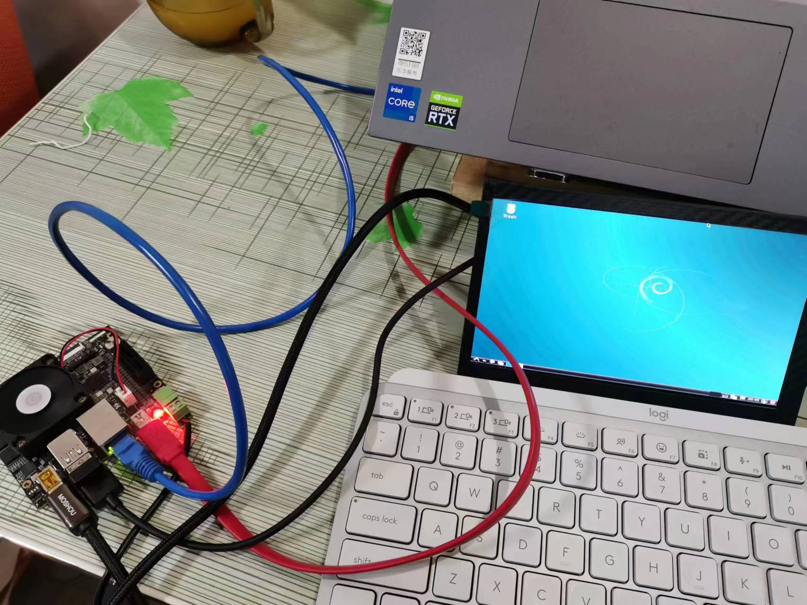

关于网络配置以及文件传输的配置：

这个东西搞了两天，今天买回来网线之后又调试了好久，终于调试好了。

下面详细的记录成功的配置流程：

## 总结踩坑

第一、SD卡一定记得装，没SD卡啥也干不了。

第二、网线还是有必要的，配置网络环境后，一方面可以ssh终端调试，一方面winscp也能够进行文件传输，没有第一时间意识到这点，还苦苦调串口，浪费了一天时间。

第三、要检查edgeboard的IP地址，有可能不是默认状态，这种情况没法和PC连接，没有意识到这点又白调了半天。

## 配置流程

**第一步：硬件连接：**

> 插上SD卡
>
> 显示屏的HDMI以及USB供电，再接一个usb接头用于鼠标在显示屏上的交互，显示屏中可以使用虚拟键盘
>
> 网线连接edgeboard以及PC
>
> USB串口连接edgeboard以及PC
>
> 连接edgeboard的电源线

**第二步：edgeboard 的IP配置**

> 这一步开始调试的时候我就忽略了，整了半天也没发现问题。网络上的大多数文档都是直接用edgeboard的默认IP，我也没想过手上的edgeboard的IP并不是默认IP，做了半天无用功。

我选择的是用图形界面来配置edgeboard的IP：

> 参考文档：[EdgeBoard嵌入式AI解决方案 - Ubuntu使用说明 | 百度AI开放平台 (baidu.com)](https://ai.baidu.com/ai-doc/HWCE/fkuqqr0q1#通过图形界面配置网络)

选用图形界面配置网络，首先需要将EdgeBoard接上显示器，进入桌面后点击右下角Edit Connections...进入网络配置页面

如果使用以太网，请选择Ethernet下的网络edgeboard_eth0

双击edgeboard_eth0，选择IPv4 Settings，点击Addresses即可编辑相关的配置，Method：Manual是静态IP设置，DHCP是动态IP设置。如果需要生效动态IP配置，需要删除静态IP的配置。

> Adress: IP地址
>
> Netmask：子网掩码
>
> Gateway ：默认网关
>
> EdgeBoard出厂默认参数为静态IP=192.168.1.254，netmask=255:255:255:0，gateway=192.168.1.1

**注意：**Netmask编辑完，点击保存后，变成24，同等于255.255.255.0，无需再次更改

网络配置完成后，在mobaxterm虚拟终端中reboot重启设备。

**第三步：配置PC端的IP**

> 详细流程参考：[EdgeBoard嵌入式AI解决方案 - 网口连接设备通讯 | 百度AI开放平台 (baidu.com)](https://ai.baidu.com/ai-doc/HWCE/3kqg6iyst#配置电脑ip)

电脑配置IP地址步骤如下：电脑和Edgeboard直连后，进入控制面板-->网络和Internet-->查看网络状态和任务

点击以太网

点击属性

点击Internet协议版本4

设置电脑IP地址为静态IP地址

点击确定。

作为测试网络配置。可以通过powershell用shh登录Edgeboard系统

Edgeboard系统是精简后的linux系统，可以通过网络SSH协议与其通讯。给设备上电后，通过电脑登录到Edgeboard系统中进行操作，Edgeboard系统的用户名和密码均为root。本教程使用window自带的终端Windows PowerShell ，具体操作如下

打开Windows PowerShell，输入`ssh root@192.168.1.254`，点击回车,如果第一次连接该ip地址，会询问是否接入，输入yes，再回车，password为不可见字符，输入root后，直接回车，即可进去Edgeboard系统

**第四步：配置文件传输**

我更习惯于可视化的文件传输，安装winscp后配置方法如下：

参照如下配置后，文件协议：scp；主机名：Edgeboard的IP；用户名&密码：root&root。点击登录

登录后，可以直接通复制粘贴命令进行电脑和设备间文件的拷贝

还可以直接阅览文件并且编辑：

