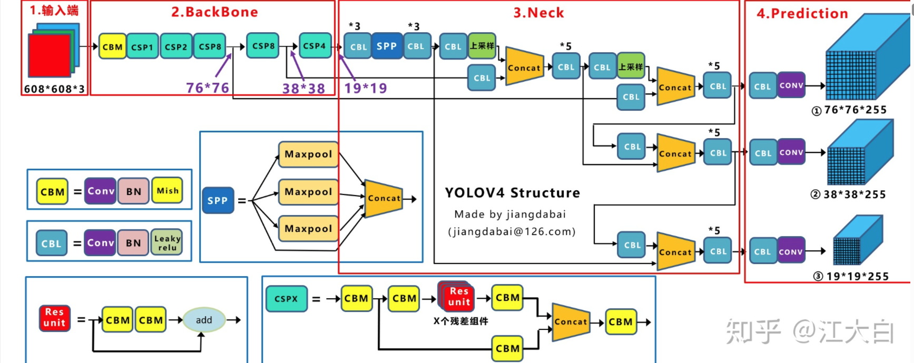

# 项目实践日志

> [(245条消息) 图像处理-椭圆检测_cheng_xing_的博客-CSDN博客_椭圆检测](https://blog.csdn.net/cheng_xing_/article/details/90256526)

通过 GMM聚类 算法实现对圆形状的分割

```python
import cv2
import numpy as np
import matplotlib.pyplot as plt
from sklearn.mixture import GaussianMixture


def cluster_image(image, n_clusters=2):
    """
    使用GMM对图像进行聚类
    :param image: 输入的图像
    :param n_clusters: 聚类数目，默认为4
    :return: 聚类后的图像
    """
    h, w, c = image.shape
    # 将图像转换为向量
    data = image.reshape((-1, 3))

    # 使用GMM进行聚类
    gmm = GaussianMixture(n_components=n_clusters)
    gmm.fit(data)
    labels = gmm.predict(data)

    color_map = {
        0: (0, 0, 0),  # 黑色
        1: (255, 0, 0),  # 绿色
        2: (0, 0, 255),  # 蓝色
        3: (255, 255, 0),  # 黄色
        4: (0, 255, 255),  # 青色
    }

    # 将像素点颜色替换为聚类颜色
    for i in range(h):
        for j in range(w):
            label = labels[i * w + j]
            color = color_map[label]
            image[i, j] = color

    # 将聚类后的图像转换为图像格式并返回
    #clustered_image = np.zeros_like(data)
    # for i in range(n_clusters):
    #     clustered_image[labels == i] = gmm.means_[i]
    # clustered_image = clustered_image.reshape(image.shape)
    return image


if __name__ == '__main__':
    # 读取图像
    img = cv2.imread("E:/DeskTop/photo/mess/circle2.jpg")
    img = cv2.cvtColor(img, cv2.COLOR_BGR2RGB)

    plt.subplot(131), plt.imshow(img), plt.title('Original Image')
    plt.xticks([]), plt.yticks([])

    edges = cv2.Canny(img, 100, 150)

    # 检测所有的轮廓
    contours, hierarchy = cv2.findContours(edges, cv2.RETR_EXTERNAL, cv2.CHAIN_APPROX_SIMPLE)

    # 遍历每一个轮廓
    for cnt in contours:
        # 判断轮廓是否为圆形
        approx = cv2.approxPolyDP(cnt, 0.01 * cv2.arcLength(cnt, True), True)
        if len(approx) >= 8:
            (x, y), radius = cv2.minEnclosingCircle(cnt)
            center = (int(x), int(y))
            radius = int(radius)
            # 绘制圆形轮廓
            cv2.circle(img, center, radius, (0, 255, 0), 1)

    plt.subplot(132), plt.imshow(img), plt.title('Clustered Image')
    plt.xticks([]), plt.yticks([])
    # 进行图像聚类
    clustered_img = cluster_image(img)
    # 显示聚类后的图像
    plt.subplot(133), plt.imshow(clustered_img), plt.title('Clustered Image')
    plt.xticks([]), plt.yticks([])
    plt.show()

```

## 2023.0303

面临的问题，如何解决：

分割明确情况下圆形标注不完全？

前景背景明确的图像依然无法准确的标注出所有的圆圈，我的目前的算法是周长和面积的比值作为判据，我考虑问题的主要出路在于如何准确的寻找出轮廓？那么我考虑在聚类后对图像进行一些边界的处理。注意到聚类之后边缘存在一些毛刺，开运算是一个不错解决方法，效果如下：


## 2023.0305

尝试使用sauvola算法进行二值化处理：


尝试使用sauvola二值化方法：


涉及较多参数调试的问题：

参数的调整在一定程度上影响阈值，例如：

k取0.5时：


k取0.1时：


经过和OTSU对比差距较小


```python
import cv2
import numpy as np
import matplotlib.pyplot as plt
from sklearn.mixture import GaussianMixture
from sauvola_test import sauvola_threshold

def cluster_image(image, n_clusters=2):
    h, w, c = image.shape
    # 将图像转换为向量
    data = image.reshape((-1, 3))

    # 使用GMM进行聚类
    gmm = GaussianMixture(n_components=n_clusters)
    gmm.fit(data)
    labels = gmm.predict(data)

    color_map = {
        0: (0, 0, 0),  # 黑色
        1: (255,225,255),  # 绿色
    }

    # 将像素点颜色替换为聚类颜色
    for i in range(h):
        for j in range(w):
            label = labels[i * w + j]
            color = color_map[label]
            image[i, j] = color

    return image

def get_edges(img):
    edges = cv2.Canny(img, 50, 150)
    return edges

def hough_circle(edge):
    circles = cv2.HoughCircles(edge, cv2.HOUGH_GRADIENT, dp=1, minDist=120,
                               param1=50, param2=20, minRadius=0, maxRadius=80)
    # 输出圆心和半径
    if circles is not None:
        circles = np.uint16(np.around(circles))
        for i in circles[0, :]:
            cv2.circle(edge, (i[0], i[1]), i[2], (255, 0, 0), 6)
            cv2.circle(edge, (i[0], i[1]), 10, (0, 0, 255), 20)
    return edge

def c_s_circle(edge,img):
    # 查找轮廓
    contours, hierarchy = cv2.findContours(edge, cv2.RETR_EXTERNAL, cv2.CHAIN_APPROX_SIMPLE)
    # 遍历每个轮廓，计算周长和面积
    for contour in contours:
        perimeter = cv2.arcLength(contour, True)
        area = cv2.contourArea(contour)
        # 计算周长和面积的比例
        ratio = perimeter * perimeter / (area +0.0000000001)
        # 判断是否为圆形,4π为12.56，比值为12到15左右可以判定
        if ratio > 10 and ratio < 25:
            (x,y),rad = cv2.minEnclosingCircle(contour)
            center = (int(x), int(y))
            rad = int(rad)
            #cv2.drawContours(img, [contour], 0, (0, 255, 0), 2)
            cv2.circle(img, center, rad, (0, 0, 255), 5)
    return img

if __name__ == '__main__':
    # 读取图像
    img1 = cv2.imread("E:/DeskTop/photo/mess/circle3.jpg")
    img = cv2.GaussianBlur(img1, (5, 5), 0)
    img = cv2.cvtColor(img, cv2.COLOR_BGR2RGB)
    plt.subplot(), plt.imshow(img), plt.title('Original Image')
    plt.xticks([]), plt.yticks([])

    gray_img = cv2.cvtColor(img, cv2.COLOR_RGB2GRAY)
    plt.subplot(), plt.imshow(gray_img), plt.title('Gray Image')
    plt.xticks([]), plt.yticks([])

    #进行二值化
    threshold_img = sauvola_threshold(gray_img,window_size=70, k=0.1, R=128)
    plt.subplot(), plt.imshow(threshold_img), plt.title('threshold Image')
    plt.xticks([]), plt.yticks([])


    # 进行图像聚类
    clustered_img = cluster_image(threshold_img)
    plt.subplot(), plt.imshow(clustered_img), plt.title('Clustered Image')
    plt.xticks([]), plt.yticks([])

    # kernel = np.ones((5, 5), np.uint8)
    # erosion = cv2.erode(clustered_img, kernel, iterations=1)
    #plt.subplot(153), plt.imshow(erosion), plt.title('erode Image')
    #进行开运算
    kernel = np.ones((7, 7), np.uint8)
    opening = cv2.morphologyEx(clustered_img, cv2.MORPH_OPEN, kernel)
    plt.subplot(), plt.imshow(opening), plt.title('opening Image')
    plt.xticks([]), plt.yticks([])

    # kernel = np.ones((3, 3), np.uint8)
    # erosion = cv2.erode(opening, kernel, iterations=1)
    # plt.subplot(164), plt.imshow(erosion), plt.title('erode Image')
    # plt.xticks([]), plt.yticks([])

    # 进行边缘检测
    edgeimg = get_edges(opening)
    plt.subplot(), plt.imshow(edgeimg), plt.title('edge Image')
    plt.xticks([]), plt.yticks([])

    #circleimg = hough_circle(edgeimg)
    circleimg = c_s_circle(edgeimg,img1)
    plt.subplot(), plt.imshow(circleimg), plt.title('circle Image')
    plt.xticks([]), plt.yticks([])
    plt.show()
```

## 2023.0308

目前考虑可能的两种处理思路。本质上都是去抓住圆形气泡的特征：

> 第一种思路是，关注气泡的灰度特征，气泡内部白，边缘是黑。

> 第二种思路是，取一个典型的气泡作为模板，在图像全局进行扫描匹配近似的点集，判断为气泡。


## 2023.0309

尝试采用模板匹配的思路：

> 1. 加载气泡图像和待处理图像，并将它们转换为灰度图像。
> 2. 使用OpenCV中的matchTemplate()函数对待处理图像进行模板匹配，该函数将返回一幅匹配结果图像。
> 3. 对匹配结果图像进行二值化处理，使得与模板匹配较好的区域像素值为255，其余像素值为0。
> 4. 对二值化处理后的图像进行形态学操作，如膨胀、腐蚀等，以消除图像中的噪点，并使得气泡轮廓更加清晰。
> 5. 最后，您可以通过在原始图像中标记匹配结果图像中像素值为255的区域，来实现对气泡的定位和分割。


## 2023.0310

尝试单个对象的模式识别：


```python
import cv2
import numpy as np

bubble = cv2.imread("E:/DeskTop/photo/bubble/circle_match.jpg", cv2.IMREAD_GRAYSCALE)
target = cv2.imread("E:/DeskTop/photo/bubble/circle3.jpg", cv2.IMREAD_GRAYSCALE)

h,w = bubble.shape[:2]

match = cv2.matchTemplate(target, bubble, cv2.TM_CCOEFF_NORMED)

minval , maxval , minloc , maxloc = cv2.minMaxLoc(match)
tl = maxloc
br = (tl[0]+w , tl[1]+h)
#br = (w,h)
cv2.rectangle(target,tl,br,(0,255,0),2)

cv2.imshow("Target", target)
cv2.waitKey(0)
cv2.destroyAllWindows()
```


对于多个模板的匹配：

> 我考虑设置一个匹配度的阈值，其中匹配度大于此阈值的在cv2.matchTemplate返回数组中设置为255，其余的都设置为0。这是一个比较原始的二值化思路。


```python
import cv2
import numpy as np
import matplotlib.pyplot as plt

bubble = cv2.imread("E:/DeskTop/photo/bubble/1match.jpg", cv2.IMREAD_GRAYSCALE)
target = cv2.imread("E:/DeskTop/photo/bubble/1part.jpg", cv2.IMREAD_GRAYSCALE)

h,w = bubble.shape[:2]
ht,wt = target.shape[:2]

match = cv2.matchTemplate(target, bubble, cv2.TM_CCOEFF_NORMED)
hm,wm = match.shape[:2]
print(h,w,ht,wt,hm,wm)
# plt.imshow(match, cmap='gray')
# plt.show()
for i in range(hm):
    for j in range(wm):
        if match[i][j] > 0.53:
            match[i][j] = 255
        else:
            match[i][j] = 0
plt.imshow(match, cmap='gray')
plt.show()


minval , maxval , minloc , maxloc = cv2.minMaxLoc(match)
tl = maxloc
br = (tl[0]+w , tl[1]+h)
cv2.rectangle( target , tl , br , (0,255,0) , 2)

cv2.imshow( "Target", target )
cv2.waitKey(0)
cv2.destroyAllWindows()
```

## 2023.03.24

两周过去了，我认为是有一些进展的：

效果大致如下：


这是一张原图，处理过后：


图像的shape(309, 344)，耗时是0.0886363s

准确率拉满了，召回率也很不错

对于新更新的一些大尺寸圆，虽然也可以识别，但是调参这个问题需要考虑如何解决：

为了获得下面这样的标注效果我调试了包括 模板延展半径，match阈值 以及 霍夫圆检测的半径阈值 多个参数才得到这样的结果：


如何解决半径普适性问题？如何应对多尺度的图像？

最新的项目代码框架：

```python 
import cv2
import numpy as np
from PIL import Image
import matplotlib.pyplot as plt
from skimage.filters import threshold_sauvola
#导入图像数据
path='E:\\DeskTop\\photo\\bubble\\1part2.jpg'
img=cv2.imread(path,cv2.IMREAD_GRAYSCALE)
image = Image.fromarray(img)

image = np.array(image)
ori_patch = image.copy()

#定义进行边缘检测的函数
def findcontours_sobel(imagex):
    # 高斯滤波，滤除部分噪声
    patch = cv2.GaussianBlur(imagex,(5,5),0)

    # sobel算子进行气泡边缘提取
    sobelx = cv2.Sobel(patch,cv2.CV_64F,1,0,ksize=3)
    sobely = cv2.Sobel(patch,cv2.CV_64F,0,1,ksize=3)
    sobelx = cv2.convertScaleAbs(sobelx)
    sobely = cv2.convertScaleAbs(sobely)
    sobelxy =  cv2.addWeighted(sobelx,0.5,sobely,0.5,0)

    # sauvola算法确定二值化阈值t_sauvola
    t_sauvola = threshold_sauvola(sobelxy, window_size=13, k=0.2, r=None)

    # 对图像进行二值化
    patch_new = np.zeros((sobelxy.shape[0],sobelxy.shape[1]),dtype = np.uint8)
    patch_new = sobelxy > t_sauvola
    patch_new = patch_new * (sobelxy-t_sauvola)
    patch_new = np.uint8(patch_new)
    return patch_new

patch_new = findcontours_sobel(image)

# 霍夫变换圆形检测
circles1 = cv2.HoughCircles(patch_new,cv2.HOUGH_GRADIENT,1, 27,param1=138,param2=13,minRadius=1,maxRadius=17)

#找到的所有圆的圆心，半径
template_circle = np.round(circles1[0,:]).astype("int")
#print("霍夫找到的圆数量 =",len(template_circle))
template_list = [] #霍夫圆模板列表

sumrad = 0 #初始化所有圆半径的总和为零

for numcircle0 in range(len(template_circle)):

    # 按顺序取出其中每一个圆
    template0 = template_circle[numcircle0]

    # 提取圆的半径
    template0_rad = template0[2]

    #求取半径总和
    sumrad = sumrad + template0_rad

#计算圆形的平均半径
aver_rad = sumrad / len(template_circle)

for numcircle in range(len(template_circle)):

    template1 = template_circle[numcircle] #按顺序取出其中每一个圆
    #提取圆的圆心坐标，半径
    template1_x = template1[0]
    template1_y = template1[1]

    #将截取的气泡模板拓展的范围大小
    expendr = 7

    #在原图上截取模板
    template = image[template1_y-(int(aver_rad)+expendr+3):template1_y+(int(aver_rad)+expendr),
                     template1_x-(int(aver_rad)+expendr+3):template1_x+(int(aver_rad)+expendr)] #(y1:y2, x1:x2)
    h,w = template.shape[:2]
    #print(h,w)

    #去除大小离群的模板
    if h < (expendr+aver_rad)*2 or w < (expendr+aver_rad)*2 :
        continue
    else:
        template_list.append(template)
# cv2.imshow("template",template_list[3])
# cv2.waitKey(0)

print("平均半径 ：",aver_rad)

    # template_contours = findcontours_sobel(template)
    # edges_template = cv2.Canny(template_contours,50,150)
    #
    # contours, hierarchy = cv2.findContours(edges_template, cv2.RETR_EXTERNAL, cv2.CHAIN_APPROX_SIMPLE)
    # # 遍历每个轮廓，计算周长和面积
    # for contour in contours:
    #     perimeter = cv2.arcLength(contour, True)
    #     area = cv2.contourArea(contour)
    #     # 计算周长和面积的比例
    #     ratio = perimeter * perimeter / (area +0.0000000001)
    #     # 判断是否为圆形,4π为12.56，比值为12到15左右可以判定
    #     if ratio > 5 and ratio < 28:
    #         print("判断为圆形的序号 ：",numcircle)
    #显示模板
    # cv2.imshow("x",template)
    # cv2.waitKey(0)
    #提取shape
    #h,w = template.shape[:2]
    #,wt = patch.shape[:2]

#进行模板匹配，返回值match表征匹配度
match_list = [] #建立列表存储每个模板的全图match值矩阵
size_match = [] #建立列表存储match的shape


#遍历所有的模板，存储每一个模板在全图的match值矩阵到列表中
for tem_num in range(len(template_list)):
    templatex = template_list[tem_num]
    match = cv2.matchTemplate(img,templatex,cv2.TM_CCOEFF_NORMED)
    match_list.append(match)
    # size_match.append(match.shape)
#print("sizematch",size_match)

#求取所有模板的match矩阵元素一一对应的平均值矩阵，这样就运用了所有的圆模板
stack_match = np.stack(match_list,axis=-1) #堆叠
avg_match = np.mean(stack_match,axis=-1) #求平均

#设置匹配阈值
thresh_match = 0.3

#记录满足阈值的坐标
location_match = np.where(avg_match>thresh_match)
loc = zip(location_match[::-1])
x,y = list(loc)

#记录坐标
list_xy = []

#计算出满足阈值点的数量
for point_num in range(len(x[0])):
    list_xy.append((x[0][point_num], y[0][point_num]))  # 坐标保存在列表中

#list_xy[x][y]表示第x个坐标，y或0或1表示横坐标或纵坐标

#去除重复的密集框
list_box = []#存储没重复的框
for j in range(len(x[0])):
    overlap = False #定义第j个框的重复状态
    #计算框与框之间的距离
    for l in range(j+1,len(x[0])):
        x_pow2 = pow(list_xy[j][0]-list_xy[l][0],2)
        y_pow2 = pow(list_xy[j][1]-list_xy[l][1],2)
        dis_box = pow(x_pow2 + y_pow2, 0.5)
        if dis_box < aver_rad : #判定存在重复，直接退出，进入下一个框
            overlap = True
            break
    if not overlap: #不存在重复的就存入列表
        list_box.append(list_xy[j])
#print("保留的坐标列表{}".format(list_box))

#绘制标注框
for ia in range(len(list_box)):
    bottom_right = (list_box[ia][0]+w,list_box[ia][1]+h)
    cv2.rectangle(img,(list_box[ia][0],list_box[ia][1]),bottom_right,(0,0,255),1)

cv2.imshow('img',img)
cv2.waitKey(0)

```


## 2023.03.26

基本的效果不错，我打算接入大图像进行处理，直接处理行不通，通过灰度聚类来分割图像也时效性太低下了，初次尝试我打算先机械化的平均分割，例如横竖各切2刀。

具体的实现思路就是如此：平均的切割原图像，记录下每张子图的坐标，方便在标注后还原。把每张子图存入一个列表中，遍历列表中的子图，执行之前的一系列处理操作，标注完毕后，再次遍历子图列表，按照记录下的坐标合并成完整的图像，处理结束。


但是还是存在以下问题：

1.恰好被线切割的一部分圆是没法判别的

2.调参很麻烦

3.大尺度圆得重新调参


## 2023.03.27

==第一、局部图像气泡判别效果==

precision和recall都较为理想

图像的shape(309, 344)，平均半径0 = 7.793103448275862，耗时是0.0768556s。


>  参数
>
> ```
> expendr = 10 
> thresh_match = 0.29
> num_split = 1
> radrange = (1,17)
> ```


图像的shape(395, 456),平均半径 = 7.1395348837209305.程序耗时 = 0.166705


> 参数
>
> ```
> expendr = 7
> thresh_match = 0.4
> num_split = 1
> radrange = (1,17)
> ```


==第二、大图像下圆的判别==

采取分割处理后合并策略：

> 图像的shape(2048, 2048)
> 平均半径0 = 7.611111111111111
> 平均半径1 = 7.056603773584905
> 平均半径2 = 7.627272727272727
> 平均半径3 = 8.022556390977444
> 平均半径4 = 7.959349593495935
> 平均半径5 = 7.887218045112782
> 平均半径6 = 5.610526315789474
> 平均半径7 = 6.349593495934959
> 平均半径8 = 6.516393442622951
> 程序耗时 = 14.2156262s
>
> 这个运行时间和切割数量成负相关，我切的越多，时间越短，切成16份，时间可减少到7秒，但是这也会导致一些圆的遗漏
>
> 局限性：
>
> 1.右上角灰度环境复杂的，match值失效了。
>
> 2.黑色背景的部分。


==第三、大尺寸非标准的圆判别==

图像的shape(2046, 2046)
平均半径0 = 36.138364779874216
程序耗时 = 17.0581682s

参数：

> ```
> expendr = 45
> thresh_match = 0.18
> num_split = 1
> radrange = (20,50)
> ```


面临的问题：

1.如何应对多尺度的圆

2.match的阈值最好做成自适应的，切割处理各部阈值统一不合理。

3.大尺度直接霍夫变换更快更准吗


==总结结果==

1.别调参数，固定一个参数，去找哪些模板是合适的，用这些模板去做匹配

2.多尺度的输入直接霍夫处理可以尝试

3.关注复杂部分的灰度情况，是以黑底为模板亦或是以白底为模板，理清楚，但是怎么解决呢？


## 2023.03.29

代码备份：

```python
import cv2
import numpy as np
from PIL import Image
import matplotlib.pyplot as plt
from skimage.filters import threshold_sauvola
import math

#进行边缘检测的函数
def findcontours_sobel(imagex):
    # 高斯滤波，滤除部分噪声
    patch = cv2.GaussianBlur(imagex,(5,5),0)

    # sobel算子进行气泡边缘提取
    sobelx = cv2.Sobel(patch,cv2.CV_64F,1,0,ksize=3)
    sobely = cv2.Sobel(patch,cv2.CV_64F,0,1,ksize=3)
    sobelx = cv2.convertScaleAbs(sobelx)
    sobely = cv2.convertScaleAbs(sobely)
    sobelxy =  cv2.addWeighted(sobelx,0.5,sobely,0.5,0)

    # sauvola算法确定二值化阈值t_sauvola
    t_sauvola = threshold_sauvola(sobelxy, window_size=13, k=0.2, r=None)

    # 对图像进行二值化
    patch_new = np.zeros((sobelxy.shape[0],sobelxy.shape[1]),dtype = np.uint8)
    patch_new = sobelxy > t_sauvola
    patch_new = patch_new * (sobelxy-t_sauvola)
    patch_new = np.uint8(patch_new)
    return patch_new

#霍夫变换检测到的圆，返回圆心半径
def hough_circle_detection(edgeimg,radrange):
    # 霍夫变换圆形检测
    circles1 = cv2.HoughCircles(edgeimg,cv2.HOUGH_GRADIENT,1, 27,param1=138,param2=13,minRadius=radrange[0],maxRadius=radrange[1])
    #找到的所有圆的圆心，半径
    template_circle = np.round(circles1[0,:]).astype("int")
    return template_circle

#计算所有圆的平均半径
def avgrad_circle(circlelist):
    sumrad = 0 #初始化所有圆半径的总和为零
    for numcircle0 in range(len(circlelist)):
        # 按顺序取出其中每一个圆
        template0 = circlelist[numcircle0]
        # 提取圆的半径
        template0_rad = template0[2]
        #求取半径总和
        sumrad = sumrad + template0_rad
    #计算圆形的平均半径
    aver_rad = sumrad / len(circlelist)
    return aver_rad

#从原图中获取每个圆的模板图像，并做筛选 ,返回模板列表，模板的h，w
def template_img(circlelist,img_ori,avg_rad,expend_r):
    template_list = []  # 霍夫圆模板列表
    for numcircle in range(len(circlelist)):

        template1 = circlelist[numcircle] #按顺序取出其中每一个圆
        #提取圆的圆心坐标，半径
        template1_x = template1[0]
        template1_y = template1[1]

        #在原图上截取模板
        template = img_ori[template1_y-(int(avg_rad)+expend_r+0):template1_y+(int(avg_rad)+expend_r),
                           template1_x-(int(avg_rad)+expend_r+0):template1_x+(int(avg_rad)+expend_r)] #(y1:y2, x1:x2)
        h,w = template.shape[:2]
        #print("h,w = {},(expend_r+avg_rad)*2 = {}".format(template.shape[:2],2*int(avg_rad)+2*expend_r))

        #去除大小离群的模板
        if h == (2*int(expend_r)+2*int(avg_rad)) and w == (2*int(expend_r)+2*int(avg_rad)):
            template_list.append(template)
        else:
            continue
    return template_list,h,w

#计算出所有的圆心模板在原图中的匹配值矩阵，返回平均值矩阵
def cul_match(tem_list,img_ori):
    #进行模板匹配，返回值match表征匹配度
    match_list = [] #建立列表存储每个模板的全图match值矩阵
    #遍历所有的模板，存储每一个模板在全图的match值矩阵到列表中
    for tem_num in range(len(tem_list)):
        templatex = tem_list[tem_num]
        match = cv2.matchTemplate(img_ori,templatex,cv2.TM_CCOEFF_NORMED)
        match_list.append(match)
    #求取所有模板的match矩阵元素一一对应的平均值矩阵，这样就运用了所有的圆模板
    #print(match_list)
    stack_match = np.stack(match_list,axis=-1) #堆叠
    avg_match = np.mean(stack_match,axis=-1) #求平均

    return avg_match

#计算出满足阈值的点在原图中的坐标
def cul_xy(thresh_matchx,avg_matchx):
    #记录满足阈值的坐标
    location_match = np.where(avg_matchx>thresh_matchx)
    loc = zip(location_match[::-1])
    x,y = list(loc)
    #记录坐标
    list_xy = []
    #计算出满足阈值点的数量
    for point_num in range(len(x[0])):
        list_xy.append((x[0][point_num], y[0][point_num]))  # 坐标保存在列表中
    #list_xy[x][y]表示第x个坐标，y或0或1表示横坐标或纵坐标

    return list_xy,x,y

#去除重复的密集框
def delete_box(xa,list_xya,avg_radx):
    list_box = []#存储没重复的框
    for j in range(len(xa[0])):
        overlap = False #定义第j个框的重复状态
        #计算框与框之间的距离
        for l in range(j+1,len(xa[0])):
            x_pow2 = pow(list_xya[j][0]-list_xya[l][0],2)
            y_pow2 = pow(list_xya[j][1]-list_xya[l][1],2)
            dis_box = pow(x_pow2 + y_pow2, 0.5)
            if dis_box < avg_radx : #判定存在重复，直接退出，进入下一个框
                overlap = True
                break
        if not overlap: #不存在重复的就存入列表
            list_box.append(list_xy[j])
    return list_box

def split_image(image, num):
    # 获取图像尺寸
    widthx, heightx = image.shape[:2]
    # 计算每个子图的宽度和高度
    sub_width = math.ceil(widthx / num)
    sub_height = math.ceil(heightx / num)
    # 定义子图列表
    sub_images = []
    #定义子图坐标列表
    point_images = []
    # 循环切割子图
    for i in range(num):
        for j in range(num):
            # 计算当前子图的左上角坐标和右下角坐标
            left = i * sub_width
            top = j * sub_height
            right = min(left + sub_width, widthx)
            bottom = min(top + sub_height, heightx)
            point_images.append((top,bottom,left,right))
            # 切割子图并添加到列表
            sub_image = image[top:bottom,left:right] # (y1:y2, x1:x2)
            sub_images.append(sub_image)
    # 返回子图列表
    return sub_images,point_images,widthx,heightx

def merge_image(parts,point_images,heighta,widtha):
    # 创建新图像
    merged_image = np.zeros((widtha,heighta), dtype=np.uint8)
    # 合并图像
    for m, part in enumerate(parts):
        merged_image[point_images[m][0]:point_images[m][1],point_images[m][2]:point_images[m][3]] = part
    #返回还原后的原大小图
    return merged_image

if __name__ == "__main__":

    '''
    本框架的超参数：
    1.将截取的气泡模板拓展的范围大小expendr
    2.设置匹配阈值thresh_match
    3.设置每行、列切割的数量num_split
    4.设置霍夫变换圆半径阈值范围
    '''


    expendr = 45
    thresh_match = 0.18
    num_split = 1
    radrange = (20,50)

    # 计算运行时间
    t1 = cv2.getTickCount()

    # 导入图像数据
    path = 'E:\\DeskTop\\photo\\bubble\\sbf008.bmp'
    img = cv2.imread(path, cv2.IMREAD_GRAYSCALE)
    print("图像的shape{}".format(img.shape[:2]))

    #将图像平均切割成若干份
    sub_images,point_images,width_ori,height_ori = split_image(img,num_split)

    #遍历处理子图
    for numx in range(len(sub_images)):
        img = sub_images[numx]
        image = Image.fromarray(img)
        image = np.array(image)

        #sobel算子计算边缘，返回二值化处理结果
        patch_new = findcontours_sobel(image)
        # cv2.imshow("1",patch_new)
        # cv2.waitKey(0)


        # 霍夫变换检测圆，返回存储每个圆信息的列表
        template_circle = hough_circle_detection(patch_new,radrange)

        #计算气泡圆平均半径
        aver_rad = avgrad_circle(template_circle)
        print("平均半径{} = {}".format(numx,aver_rad))

        # 从原图中获取每个圆的模板图像，并做筛选 , 返回模板列表，模板的h，w
        template_list,h,w = template_img(template_circle, image, aver_rad, expendr)
        # cv2.imshow("1",template_list[0])
        # cv2.waitKey(0)

        #计算出所有的圆心模板在原图中的匹配值矩阵，返回平均值矩阵
        avg_match = cul_match(template_list, img)

        #计算出满足match阈值的坐标
        list_xy,x,y = cul_xy(thresh_match, avg_match)

        #删除重复的boxes
        list_box = delete_box(x, list_xy, aver_rad)

        # 绘制标注框
        for ia in range(len(list_box)):
            bottom_right = (list_box[ia][0] + w, list_box[ia][1] + h)
            cv2.rectangle(img, (list_box[ia][0], list_box[ia][1]), bottom_right, (0, 0, 255), 1)

    dstimg = merge_image(sub_images,point_images,height_ori,width_ori)

    # 计算时间
    t2 = cv2.getTickCount()
    t_demo = (t2 - t1) / cv2.getTickFrequency()
    print("程序耗时 = {}s".format(t_demo))

    cv2.imshow('img', dstimg)
    cv2.waitKey(0)
    # cv2.imwrite("E:\\DeskTop\\photo\\bubble\\dst5.jpg",dstimg)
```

我的想法是：

> 对于match值的处理，算出区域内的所有match的均值，以此均值作为阈值，再进行一次符合条件的点的搜索。
>
> > 验证完毕，想法完全不可行，有相当大的像素部分的match是很低的，这个求出来的均值几乎靠近0，没有任何作为阈值的意义。
>
> 不想放弃这个想法，前面我通过hough判断出圆的数量了，那么以这个数量为基础，取出match值列表中第若干个match值，当然这个若干数是等于圆的数量的。

> 更进一步的，将这个阈值固定，去寻找可用的模板。

## 2023.03.30

代码备份：

```python
import cv2
import numpy as np
from PIL import Image
import matplotlib.pyplot as plt
from skimage.filters import threshold_sauvola
import math
from tqdm import tqdm #导入进度条
import statistics

#进行边缘检测的函数
def findcontours_sobel(imagex):
    # 高斯滤波，滤除部分噪声
    patch = cv2.GaussianBlur(imagex,(5,5),0)

    # sobel算子进行气泡边缘提取
    sobelx = cv2.Sobel(patch,cv2.CV_64F,1,0,ksize=3)
    sobely = cv2.Sobel(patch,cv2.CV_64F,0,1,ksize=3)
    sobelx = cv2.convertScaleAbs(sobelx)
    sobely = cv2.convertScaleAbs(sobely)
    sobelxy =  cv2.addWeighted(sobelx,0.5,sobely,0.5,0)

    # sauvola算法确定二值化阈值t_sauvola
    t_sauvola = threshold_sauvola(sobelxy, window_size=13, k=0.2, r=None)

    # 对图像进行二值化
    patch_new = np.zeros((sobelxy.shape[0],sobelxy.shape[1]),dtype = np.uint8)
    patch_new = sobelxy > t_sauvola
    patch_new = patch_new * (sobelxy-t_sauvola)
    patch_new = np.uint8(patch_new)
    return patch_new

#霍夫变换检测到的圆，返回圆心半径
def hough_circle_detection(edgeimg,radrange):
    # 霍夫变换圆形检测
    circles1 = cv2.HoughCircles(edgeimg,cv2.HOUGH_GRADIENT,1,27,param1=138,param2=13,minRadius=radrange[0],maxRadius=radrange[1])
    #找到的所有圆的圆心，半径
    template_circle = np.round(circles1[0,:]).astype("int")
    return template_circle

#计算所有圆的平均半径
def avgrad_circle(circlelist):
    sumrad = 0 #初始化所有圆半径的总和为零
    for numcircle0 in range(len(circlelist)):
        # 按顺序取出其中每一个圆
        template0 = circlelist[numcircle0]
        # 提取圆的半径
        template0_rad = template0[2]
        #求取半径总和
        sumrad = sumrad + template0_rad
    #计算圆形的平均半径
    aver_rad = sumrad / len(circlelist)
    #有多少个圆
    numyuan = len(circlelist)
    return aver_rad ,numyuan

#从原图中获取每个圆的模板图像，并做筛选 ,返回模板列表，模板的h，w
def template_img(circlelist,img_ori,avg_rad,expend_r):
    template_list = []  # 霍夫圆模板列表
    for numcircle in range(len(circlelist)):

        template1 = circlelist[numcircle] #按顺序取出其中每一个圆
        #提取圆的圆心坐标，半径
        template1_x = template1[0]
        template1_y = template1[1]

        #在原图上截取模板
        template = img_ori[template1_y-(int(avg_rad)+expend_r+0):template1_y+(int(avg_rad)+expend_r),
                           template1_x-(int(avg_rad)+expend_r+0):template1_x+(int(avg_rad)+expend_r)] #(y1:y2, x1:x2)
        h,w = template.shape[:2]
        #print("h,w = {},(expend_r+avg_rad)*2 = {}".format(template.shape[:2],2*int(avg_rad)+2*expend_r))

        #去除大小离群的模板
        if h == (2*int(expend_r)+2*int(avg_rad)) and w == (2*int(expend_r)+2*int(avg_rad)):
            template_list.append(template)
        else:
            continue
    return template_list,h,w

#计算出所有的圆心模板在原图中的匹配值矩阵，返回平均值矩阵
def cul_match(tem_list,img_ori):
    #进行模板匹配，返回值match表征匹配度
    match_list = [] #建立列表存储每个模板的全图match值矩阵
    #遍历所有的模板，存储每一个模板在全图的match值矩阵到列表中
    for tem_num in range(len(tem_list)):
        templatex = tem_list[tem_num]
        match = cv2.matchTemplate(img_ori,templatex,cv2.TM_CCOEFF_NORMED)
        match_list.append(match)
    #求取所有模板的match矩阵元素一一对应的平均值矩阵，这样就运用了所有的圆模板
    #print(match_list)
    stack_match = np.stack(match_list,axis=-1) #堆叠
    avg_match = np.mean(stack_match,axis=-1) #求平均

    return avg_match

#计算出满足阈值的点在原图中的坐标
def cul_xy(thresh_matchx,avg_matchx):
    #记录满足阈值的坐标
    location_match = np.where(avg_matchx>thresh_matchx)
    # print("match均值",np.mean(avg_matchx))
    loc = zip(location_match[::-1])
    x,y = list(loc)
    #记录坐标
    list_xy = []
    #计算出满足阈值点的数量
    for point_num in range(len(x[0])):
        list_xy.append((x[0][point_num], y[0][point_num]))  # 坐标保存在列表中
    #list_xy[x][y]表示第x个坐标，y或0或1表示横坐标或纵坐标

    return list_xy,x,y

#去除重复的密集框
def delete_box(xa,list_xya,avg_radx):
    list_box = []#存储没重复的框
    for j in range(len(xa[0])):
        overlap = False #定义第j个框的重复状态
        #计算框与框之间的距离
        for l in range(j+1,len(xa[0])):
            x_pow2 = pow(list_xya[j][0]-list_xya[l][0],2)
            y_pow2 = pow(list_xya[j][1]-list_xya[l][1],2)
            dis_box = pow(x_pow2 + y_pow2, 0.5)
            if dis_box < avg_radx : #判定存在重复，直接退出，进入下一个框
                overlap = True
                break
        if not overlap: #不存在重复的就存入列表
            list_box.append(list_xy[j])
    return list_box

def split_image(image, num):
    # 获取图像尺寸
    widthx, heightx = image.shape[:2]
    # 计算每个子图的宽度和高度
    sub_width = math.ceil(widthx / num)
    sub_height = math.ceil(heightx / num)
    # 定义子图列表
    sub_images = []
    #定义子图坐标列表
    point_images = []
    # 循环切割子图
    for i in range(num):
        for j in range(num):
            # 计算当前子图的左上角坐标和右下角坐标
            left = i * sub_width
            top = j * sub_height
            right = min(left + sub_width, widthx)
            bottom = min(top + sub_height, heightx)
            point_images.append((top,bottom,left,right))
            # 切割子图并添加到列表
            sub_image = image[top:bottom,left:right] # (y1:y2, x1:x2)
            sub_images.append(sub_image)
    # 返回子图列表
    return sub_images,point_images,widthx,heightx

def merge_image(parts,point_images,heighta,widtha):
    # 创建新图像
    merged_image = np.zeros((widtha,heighta), dtype=np.uint8)
    # 合并图像
    for m, part in enumerate(parts):
        merged_image[point_images[m][0]:point_images[m][1],point_images[m][2]:point_images[m][3]] = part
    #返回还原后的原大小图
    return merged_image

def update_template(img,boxlist,h,w):
    template_update = []
    for boxnum in range(len(boxlist)):
        # (y1:y2, x1:x2)
        template_up = img[boxlist[boxnum][1]:boxlist[boxnum][1]+h,
                      boxlist[boxnum][0]:boxlist[boxnum][0]+w]
        template_update.append(template_up)
    return template_update


def update_th(matchx):
    # 求出较为稳定的阈值，用于后续筛选最有效的模板
    avg_match11 = matchx
    for i in range(len(matchx)):
        for j in range(len(matchx[i])):
            avg_match11[i][j] = '{:.5f}'.format(matchx[i][j])
    avg_match11 = [element for row in avg_match11 for element in row]
    # 排序
    avg_match11.sort()
    # 获取列表的长度
    n = len(avg_match11)
    # 求得最优的阈值
    best_th = avg_match11[-numyuan]
    # print("更新阈值={}".format(best_th))
    return best_th


if __name__ == "__main__":

    '''
    本框架的超参数：
    1.将截取的气泡模板拓展的范围大小expendr（已经优化）
    2.设置匹配阈值thresh_match(已经优化)
    3.设置每行、列切割的数量num_split
    4.设置霍夫变换圆半径阈值范围radrange
    '''

    expendr = 0
    # thresh_match = 0.41593
    num_split = 4
    radrange = (1, 17)

    # 计算运行时间
    t1 = cv2.getTickCount()

    # 导入图像数据
    path = 'E:\\DeskTop\\photo\\bubble\\1.jpg'
    img = cv2.imread(path, cv2.IMREAD_GRAYSCALE)
    print("图像的shape{}".format(img.shape[:2]))

    #将图像平均切割成若干份
    sub_images,point_images,width_ori,height_ori = split_image(img,num_split)

    imagergb_list = []
    #遍历处理子图
    for numx in tqdm(range(len(sub_images))):
        img = sub_images[numx]
        image = Image.fromarray(img)
        image = np.array(image)

        #sobel算子计算边缘，返回二值化处理结果
        patch_new = findcontours_sobel(image)
        # cv2.imshow("1",patch_new)
        # cv2.waitKey(0)

        # 霍夫变换检测圆，返回存储每个圆信息的列表
        template_circle = hough_circle_detection(patch_new,radrange)

        #计算气泡圆平均半径
        aver_rad ,numyuan = avgrad_circle(template_circle)
        #print("平均半径{} = {}".format(numx,aver_rad))

        # 从原图中获取每个圆的模板图像，并做筛选 , 返回模板列表，模板的h,w
        template_list,h,w = template_img(template_circle, image, aver_rad, expendr)
        # cv2.imshow("1",template_list[0])
        # cv2.waitKey(0)

        #计算出所有的圆心模板在原图中的匹配值矩阵，返回平均值矩阵
        avg_match = cul_match(template_list, img)

        #更新阈值，取出排序靠前的阈值
        best_th = update_th(avg_match)

        #计算出满足match阈值的坐标
        list_xy,x,y = cul_xy(best_th, avg_match)

        #删除重复的boxes
        list_box = delete_box(x, list_xy, aver_rad)

        #更新模板---把筛选过后的模板取出，存入列表
        template_update = update_template(img,list_box,h,w)

        # 重复此过程*************************************
        # 计算出所有的圆心模板在原图中的匹配值矩阵，返回平均值矩阵
        avg_match = cul_match(template_update, img)

        best_th = update_th(avg_match)
        # 计算出满足match阈值的坐标
        list_xy, x, y = cul_xy(best_th, avg_match)

        # 删除重复的boxes
        list_box = delete_box(x, list_xy, aver_rad)

        #循环第二次********************************
        # 更新模板---把筛选过后的模板取出，存入列表
        template_update = update_template(img,list_box,h,w)

        # 计算出所有的圆心模板在原图中的匹配值矩阵，返回平均值矩阵
        avg_match = cul_match(template_update,img)

        best_th = update_th(avg_match)
        # 计算出满足match阈值的坐标
        list_xy, x, y = cul_xy(best_th, avg_match)

        # 删除重复的boxes
        list_box = delete_box(x, list_xy, aver_rad)

        # 绘制标注框
        for ia in range(len(list_box)):
            bottom_right = (list_box[ia][0] + w, list_box[ia][1] + h)
            # cv2.rectangle(img, (list_box[ia][0], list_box[ia][1]), bottom_right, (128, 128 , 255), 2)
            # cv2.circle(img,(list_box[ia][0]+w/2,list_box[ia][1]+h/2),4,(128,128,255))
            radpointx = list_box[ia][0] + int(w/2)
            radpointy = list_box[ia][1] + int(h/2)
            # img_rgb = cv2.cvtColor(img,cv2.COLOR_GRAY2RGB)
            cv2.circle(img,(radpointx,radpointy),15,(255,0,0),3)
            # imagergb_list.append(img_rgb)

    dstimg = merge_image(sub_images,point_images,height_ori,width_ori)
    # dstimg = merge_image(imagergb_list, point_images, height_ori, width_ori)


    # 计算时间
    t2 = cv2.getTickCount()
    t_demo = (t2 - t1) / cv2.getTickFrequency()
    print("程序耗时 = {}s".format(t_demo))

    # cv2.imshow('img',image_rgb)
    # cv2.waitKey(0)
    cv2.imwrite("E:\\DeskTop\\photo\\bubble\\dst8.jpg",dstimg)
```

测试证明，<通过对全局的match值进行排序，取出排序位置在圆的对应个数的位置的match值，将基于此match值匹配到的圆作为模板，反过来进行全局的匹配>这样的想法确实可行，这样的筛选是严格的，留下的模板都是精确且合适的，但是我依旧需要考虑在全局遍历之后，应该设置一个多大的阈值，来筛选匹配对象？

我的做法是，再进行一次match值排序，取出上述那个合适的match值，把他作为阈值。

结果就是：

> 第一，去除了设定阈值这个超参数
>
> 第二，因为阈值很苛刻，precision相当高，但是recall较差。

更进一步的，模板的大小我直接使用hough变换找到的圆的半径，而不是扩充一个尺寸后再作为半径，可以减少一个超参数的调试。

> 简单而言，效果不错，甚至比之前扩充模板要更好。


## 2023.03.31

思路上的跟进：

我在考虑如何确定一个较优的阈值，在前序通过多次的模板迭代，最优的match值已经被提升到了一个较为严格的程度，也正是因为这个严格的阈值，导致高p低r。我的想法是基于这个严格的阈值，以一个较低的步距在循环中不断的降低它，每一次都检查 经过 去重后剩下的标注框的数量有没有大于我们找到的圆的数量（前面已经验证了霍夫变换在这张图上可以较为准确的找准圆的数量）。

结果是理想的，在一定程度上通过这个方法确定了较优的阈值。

代码备份：

```python
import cv2
import numpy as np
from PIL import Image
import matplotlib.pyplot as plt
from skimage.filters import threshold_sauvola
import math
from tqdm import tqdm #导入进度条
import statistics

#进行边缘检测的函数
def findcontours_sobel(imagex):
    # 高斯滤波，滤除部分噪声
    patch = cv2.GaussianBlur(imagex,(5,5),0)

    # sobel算子进行气泡边缘提取
    sobelx = cv2.Sobel(patch,cv2.CV_64F,1,0,ksize=3)
    sobely = cv2.Sobel(patch,cv2.CV_64F,0,1,ksize=3)
    sobelx = cv2.convertScaleAbs(sobelx)
    sobely = cv2.convertScaleAbs(sobely)
    sobelxy =  cv2.addWeighted(sobelx,0.5,sobely,0.5,0)

    # sauvola算法确定二值化阈值t_sauvola
    t_sauvola = threshold_sauvola(sobelxy, window_size=13, k=0.2, r=None)

    # 对图像进行二值化
    patch_new = np.zeros((sobelxy.shape[0],sobelxy.shape[1]),dtype = np.uint8)
    patch_new = sobelxy > t_sauvola
    patch_new = patch_new * (sobelxy-t_sauvola)
    patch_new = np.uint8(patch_new)
    return patch_new

#霍夫变换检测到的圆，返回圆心半径
def hough_circle_detection(edgeimg,radrange):
    # 霍夫变换圆形检测
    circles1 = cv2.HoughCircles(edgeimg,cv2.HOUGH_GRADIENT,1,27,param1=138,param2=13,minRadius=radrange[0],maxRadius=radrange[1])
    #找到的所有圆的圆心，半径
    template_circle = np.round(circles1[0,:]).astype("int")
    return template_circle

#计算所有圆的平均半径
def avgrad_circle(circlelist):
    sumrad = 0 #初始化所有圆半径的总和为零
    for numcircle0 in range(len(circlelist)):
        # 按顺序取出其中每一个圆
        template0 = circlelist[numcircle0]
        # 提取圆的半径
        template0_rad = template0[2]
        #求取半径总和
        sumrad = sumrad + template0_rad
    #计算圆形的平均半径
    aver_rad = sumrad / len(circlelist)
    #有多少个圆
    numyuan = len(circlelist)
    return aver_rad ,numyuan

#从原图中获取每个圆的模板图像，并做筛选 ,返回模板列表，模板的h，w
def template_img(circlelist,img_ori,avg_rad,expend_r):
    template_list = []  # 霍夫圆模板列表
    for numcircle in range(len(circlelist)):

        template1 = circlelist[numcircle] #按顺序取出其中每一个圆
        #提取圆的圆心坐标，半径
        template1_x = template1[0]
        template1_y = template1[1]

        #在原图上截取模板
        template = img_ori[template1_y-(int(avg_rad)+expend_r+0):template1_y+(int(avg_rad)+expend_r),
                           template1_x-(int(avg_rad)+expend_r+0):template1_x+(int(avg_rad)+expend_r)] #(y1:y2, x1:x2)
        h,w = template.shape[:2]

        #去除大小离群的模板
        if h == (2*int(expend_r)+2*int(avg_rad)) and w == (2*int(expend_r)+2*int(avg_rad)):
            template_list.append(template)
        else:
            continue
    return template_list,h,w

#计算出所有的圆心模板在原图中的匹配值矩阵，返回平均值矩阵
def cul_match(tem_list,img_ori):
    #进行模板匹配，返回值match表征匹配度
    match_list = [] #建立列表存储每个模板的全图match值矩阵
    #遍历所有的模板，存储每一个模板在全图的match值矩阵到列表中
    for tem_num in range(len(tem_list)):
        templatex = tem_list[tem_num]
        match = cv2.matchTemplate(img_ori,templatex,cv2.TM_CCOEFF_NORMED)
        match_list.append(match)
    #求取所有模板的match矩阵元素一一对应的平均值矩阵，这样就运用了所有的圆模板
    #print(match_list)
    stack_match = np.stack(match_list,axis=-1) #堆叠
    avg_match = np.mean(stack_match,axis=-1) #求平均

    return avg_match

#计算出满足阈值的点在原图中的坐标
def cul_xy(thresh_matchx,avg_matchx):
    #记录满足阈值的坐标
    location_match = np.where(avg_matchx>thresh_matchx)
    # print("match均值",np.mean(avg_matchx))
    loc = zip(location_match[::-1])
    x,y = list(loc)
    #记录坐标
    list_xy = []
    #计算出满足阈值点的数量
    for point_num in range(len(x[0])):
        list_xy.append((x[0][point_num], y[0][point_num]))  # 坐标保存在列表中
    #list_xy[x][y]表示第x个坐标，y或0或1表示横坐标或纵坐标

    return list_xy,x,y

#去除重复的密集框
def delete_box(xa,list_xya,avg_radx):
    list_box = []#存储没重复的框
    for j in range(len(xa[0])):
        overlap = False #定义第j个框的重复状态
        #计算框与框之间的距离
        for l in range(j+1,len(xa[0])):
            x_pow2 = pow(list_xya[j][0]-list_xya[l][0],2)
            y_pow2 = pow(list_xya[j][1]-list_xya[l][1],2)
            dis_box = pow(x_pow2 + y_pow2, 0.5)
            if dis_box < avg_radx : #判定存在重复，直接退出，进入下一个框
                overlap = True
                break
        if not overlap: #不存在重复的就存入列表
            list_box.append(list_xy[j])
    return list_box

def split_image(image, num):
    # 获取图像尺寸
    widthx, heightx = image.shape[:2]
    # 计算每个子图的宽度和高度
    sub_width = math.ceil(widthx / num)
    sub_height = math.ceil(heightx / num)
    # 定义子图列表
    sub_images = []
    #定义子图坐标列表
    point_images = []
    # 循环切割子图
    for i in range(num):
        for j in range(num):
            # 计算当前子图的左上角坐标和右下角坐标
            left = i * sub_width
            top = j * sub_height
            right = min(left + sub_width, widthx)
            bottom = min(top + sub_height, heightx)
            point_images.append((top,bottom,left,right))
            # 切割子图并添加到列表
            sub_image = image[top:bottom,left:right] # (y1:y2, x1:x2)
            sub_images.append(sub_image)
    # 返回子图列表
    return sub_images,point_images,widthx,heightx

def merge_image(parts,point_images,heighta,widtha,imgx):
    # 创建新图像
    # merged_image = np.zeros((widtha,heighta,3), dtype=np.uint8)
    imgx = cv2.cvtColor(imgx, cv2.COLOR_GRAY2RGB)
    merged_image = np.zeros_like(imgx)
    # 合并图像
    for m, part in enumerate(parts):
        merged_image[point_images[m][0]:point_images[m][1],point_images[m][2]:point_images[m][3]] = part
    #返回还原后的原大小图
    return merged_image

def update_template(img,boxlist,h,w):
    template_update = []
    for boxnum in range(len(boxlist)):
        # (y1:y2, x1:x2)
        template_up = img[boxlist[boxnum][1]:boxlist[boxnum][1]+h,
                      boxlist[boxnum][0]:boxlist[boxnum][0]+w]
        template_update.append(template_up)
    return template_update


def update_th(matchx,numyuanx):
    # 求出较为稳定的阈值，用于后续筛选最有效的模板
    avg_match11 = matchx
    for i in range(len(matchx)):
        for j in range(len(matchx[i])):
            avg_match11[i][j] = '{:.5f}'.format(matchx[i][j])
    avg_match11 = [element for row in avg_match11 for element in row]
    # 排序
    avg_match11.sort()
    # 获取列表的长度
    n = len(avg_match11)
    # 求得最优的阈值
    best_th = avg_match11[-numyuanx]
    # print("更新阈值={}".format(best_th))
    return best_th


if __name__ == "__main__":

    '''
    本框架的超参数：
    1.将截取的气泡模板拓展的范围大小expendr（已经优化）
    2.设置匹配阈值thresh_match(已经优化)
    3.设置每行、列切割的数量num_split
    4.设置霍夫变换圆半径阈值范围radrange
    '''

    expendr = 0
    # thresh_match = 0.41593
    num_split = 4
    radrange = (1, 17)

    # 计算运行时间
    t1 = cv2.getTickCount()

    # 导入图像数据
    path = 'E:\\DeskTop\\photo\\bubble\\1.jpg'
    img_ori = cv2.imread(path,cv2.IMREAD_GRAYSCALE)
    print("图像的shape{}".format(img_ori.shape[:2]))

    #将图像平均切割成若干份
    sub_images,point_images,width_ori,height_ori = split_image(img_ori,num_split)

    imagergb_list = []
    #遍历处理子图
    for numx in tqdm(range(len(sub_images))):
        img = sub_images[numx]
        image = Image.fromarray(img)
        image = np.array(image)

        #sobel算子计算边缘，返回二值化处理结果
        patch_new = findcontours_sobel(image)
        # cv2.imshow("1",patch_new)
        # cv2.waitKey(0)

        # 霍夫变换检测圆，返回存储每个圆信息的列表
        template_circle = hough_circle_detection(patch_new,radrange)

        #计算气泡圆平均半径
        aver_rad ,numyuan = avgrad_circle(template_circle)
        #print("平均半径{} = {}".format(numx,aver_rad))

        # 从原图中获取每个圆的模板图像，并做筛选 , 返回模板列表，模板的h,w
        template_list,h,w = template_img(template_circle, image, aver_rad, expendr)
        # cv2.imshow("1",template_list[0])
        # cv2.waitKey(0)

        #计算出所有的圆心模板在原图中的匹配值矩阵，返回平均值矩阵
        avg_match = cul_match(template_list, img)


        #更新阈值，取出排序靠前的阈值
        best_th = update_th(avg_match,numyuan)

        #计算出满足match阈值的坐标
        list_xy,x,y = cul_xy(best_th, avg_match)

        #删除重复的boxes
        list_box = delete_box(x, list_xy, aver_rad)

        #循环进行两次模板迭代********************************
        for upnum in range(2):
            # 更新模板---把筛选过后的模板取出，存入列表
            template_update = update_template(img,list_box,h,w)

            # 计算出所有的圆心模板在原图中的匹配值矩阵，返回平均值矩阵
            avg_match = cul_match(template_update,img)

            best_th = update_th(avg_match,numyuan)
            # 计算出满足match阈值的坐标
            list_xy, x, y = cul_xy(best_th, avg_match)

            # 删除重复的boxes
            list_box = delete_box(x,list_xy,aver_rad)
        while(len(list_box) < numyuan):
            best_th = best_th - 0.01  #迭代降低阈值，直到找出所有圆（理论数量）
            # 计算出满足match阈值的坐标
            list_xy, x, y = cul_xy(best_th, avg_match)
            # 删除重复的boxes
            list_box = delete_box(x, list_xy, aver_rad)

        img_rgb = cv2.cvtColor(img, cv2.COLOR_GRAY2RGB)
        # 绘制标注框
        for ia in range(len(list_box)):
            bottom_right = (list_box[ia][0] + w, list_box[ia][1] + h)
            # cv2.rectangle(img, (list_box[ia][0], list_box[ia][1]), bottom_right, (128, 128 , 255), 2)
            radpointx = list_box[ia][0] + int(w/2)
            radpointy = list_box[ia][1] + int(h/2)
            # img_rgb = cv2.cvtColor(img,cv2.COLOR_GRAY2RGB)
            cv2.circle(img_rgb,(radpointx,radpointy),15,(0,0,255),2)

        imagergb_list.append(img_rgb)

    # dstimg = merge_image(sub_images,point_images,height_ori,width_ori,img)
    dstimg = merge_image(imagergb_list, point_images, height_ori, width_ori,img_ori)


    # 计算时间
    t2 = cv2.getTickCount()
    t_demo = (t2 - t1) / cv2.getTickFrequency()
    print("程序耗时 = {}s".format(t_demo))

    # cv2.imshow('img',image_rgb)
    # cv2.waitKey(0)
    cv2.imwrite("E:\\DeskTop\\photo\\bubble\\dst11.jpg",dstimg)
```


## 2023.04.02

汇报：

第一，大图小气泡：

第二，大气泡：


汇总所有的图像结果，打包压缩。

## 2023.04.03

和材料学院的老师见面，确定需求，需要输出每个识别到的气泡的圆形坐标位置。


## 2023.04.08

对于大部分的圆形，我采用hough相关的做法，输出圆形坐标本身并不麻烦。

但是存在两个点的需要优化的：

1.模板匹配的框架对图像进行了分割，其坐标都是相对于分割后的图像的，需要做一个校正。当然这一批我没用分割，图省事。

2.对于圆形的检测hough变换的调参，实在是麻烦，这批图我很难用一个参数去实现全局的最优，每张图像都要做一些微调。希望通过深度学习来解决这个问题

其次，在框架中我强行要求在最优的阈值上再多找100个圆，因为以一个严格的阈值，recall确实是不够看的，虽然precision挺不错。

这又涉及到一个取舍，对于我们材料的任务，更加关注的是precision还是recall呢？

对于一些特殊的圆，我在sauvola二值化的基础上再用了canny提取边缘，然后再输出给hough 的效果看来是更好的。


## 2023.04.10

本周任务安排如下：

1.就已经有的材料srtp数据集作为测试集，验证框架的推理精度precision，recall，F1等

2.尝试深度网络看看效果，标注框需要转换为矩形的，labels就是box坐标了

## 2023.04.13

没有直接可用的坐标数据，只能根据现有的标注图像来做逆向工程，还原出坐标以及半径信息。

两个关键点，清除掉数字标识，提取出标注好的红色圆圈。


首先尝试对全图像素遍历，把红色像素的所有通道一律置为0，不是红色像素的一律置为255，作为一个粗略的二值化。

事实上结果很差，看似精准的像素遍历，会引入大量其他的点。

又尝试进行形态学处理，再做canny，走远了。

和老师交流，用颜色通道的运算会是一个强有力的操作：

> 这也反映出我对于颜色通道的理解不够深刻

最终实践思路如下：

> 把三个通道分割出来，用b-r，这里需要考虑一下：
>
> 不能直接进行像素的加减，溢出后数值按照255进制来计算，结果不可控。
>
> 选择cv2.add（），溢出会进行截断
>
> 利用不同通道的亮度差，把圆形取出，在r上圆形很亮，b上就较为暗，b-r圆形部分必然是0值。

效果很好：


后面就思路清晰，形态学腐蚀，而后进行hough检测计算圆形的信息即可。


## 2023.04.14

首先是几张有标签的图像，计算了pr值以及f1-score，求取f1-score的思路上是较为清晰的：

> ```
> # ======================框架====================== #
> # 导入测试集以及预测数据
> # 测试集总数先默认算FN(理解为全部没找出来)
> # 预测总数先默认算FP(理解为全部找错了)
> # 嵌套循环，每一个预测数据与所有的测试集求iou，取出max
> # max与设置的iou阈值进行比较，判正一个 +TP -FP -FN
> # 计算precision, recall, F1-score
> # =============================================== #
> ```

代码备份：

> ```python
> import os
> import json
> import math
> 
> 
> def cal_iou(l_pre, l_test):
>     # 提取圆心坐标和半径
>     x1, y1, r1 = l_pre[0], l_pre[1], l_pre[2]
>     x2, y2, r2 = l_test[0], l_test[1], l_test[2]
> 
>     # 计算圆心距离
>     d = float(math.sqrt((x2 - x1) ** 2 + (y2 - y1) ** 2))
> 
>     # 判断两个圆之间的位置状态
>     # 两个圆不相交
>     if r1 + r2 <= d:
>         iou = 0
>         return iou
> 
>     # 1包裹2
>     if r1 - r2 >= d:
>         intersection_area = math.pi * r2 * r2
>         union_area = math.pi * r1 * r1
>         iou = intersection_area / union_area
>         return iou
> 
>     # 2包裹1
>     if r2 - r1 >= d:
>         intersection_area = math.pi * r1 * r1
>         union_area = math.pi * r2 * r2
>         iou = intersection_area / union_area
>         return iou
> 
>     # 两个圆相交
>     else:
>         # 计算交集面积
>         if 2 * d * r1 == 0:
>             print(l_pre, l_test)
>         angle1 = math.acos((r1 * r1 + d * d - r2 * r2 ) / (2 * d * r1))
>         angle2 = math.acos((r2 * r2 + d * d - r1 * r1) / (2 * d * r2))
>         intersection_area = r1 * r1 * angle1 + r2 * r2 * angle2 - math.sin(angle1) * r1 * d
>         # 计算并集面积
>         union_area = math.pi * r1 ** 2 + math.pi * r2 ** 2 - intersection_area
>         # 计算交并比
>         iou = intersection_area / union_area
>         return iou
> 
> 
> test_datapath = 'E:/DeskTop/photo/bubble/small/point_data/6_test.txt'  # 测试集路径
> predict_datapath = 'E:/DeskTop/photo/bubble/small/point_data/6_pred.txt'  # 预测数据路径
> 
> # 读入数据并转成列表存储
> data_tests = []  # 测试集数据列表
> with open(test_datapath, "r") as file:
>     data_test = file.read().splitlines()
> for num_data1 in range(len(data_test)):
>     data_tests.append(json.loads(data_test[num_data1]))
> 
> data_pres = []  # 预测数据列表
> with open(predict_datapath, "r") as file:
>     data_pre = file.read().splitlines()
> for num_data2 in range(len(data_pre)):
>     data_pres.append(json.loads(data_pre[num_data2]))
> 
> # 定义FN FP TP iouthres
> FN = len(data_tests)
> FP = len(data_pres)
> TP = 0
> iouthres = 0.33
> 
> # 求取max iou
> for num_pre in range(len(data_pres)):
>     iou_max = 0
>     for num_test in range(len(data_tests)):
>         ioux = cal_iou(data_pres[num_pre], data_tests[num_test])  # 计算每一个predict的iou
>         if ioux > iou_max:
>             iou_max = ioux
>     # 阈值判定
>     if iou_max > iouthres:
>         TP = TP + 1
>         FN = FN - 1
>         FP = FP - 1
> precision = TP / (TP + FP)
> recall = TP / (TP + FN)
> F1 = 2 * precision * recall / (precision + recall)
> print("precision = {}\n".format(precision),"recall = {}\n".format(recall),"f1-score = {}\n".format(F1))
> with open("E:/DeskTop/photo/bubble/small/f1/6_f1.txt", "w") as file:
>     file.write("precision = {}\n".format(precision))
>     file.write("recall = {}\n".format(recall))
>     file.write("f1-score = {}\n".format(F1))
> ```

这个部分就完成了：下面是简单取两张的效果记录：


## 2023.04.16

下一步尝试使用深度学习的方法来进行气泡对象的检测，首先是关于数据集的制作:

第一是在大图上截取我觉得清晰的部分，用之前的代码框架运行出结果之后，把圆的坐标半径信息，按照yolo的txt格式存储起来，（都转化成在原图中的比例），类别都设置为0 。随机做了20张数据集。

关于使用神经网络，我很熟悉yolov5的使用，就直接先用yolo试试效果。数据集量太小，试试效果，我没有设置验证集。

我的GPU是：NVIDIA GeForce RTX 3060 Laptop GPU, 6144MiB

下面是训练1000e 的后模型的推理效果：每张推理时间在4ms以内


大尺度的推理效果不佳，因为数据集中没有这类图像：


## 2023.04.17

例行组会，本周目标：

1.扩增数据集

2.多尺度输入测试

## 2023.04.18

扩增20张数据，都是小尺寸气泡。以训练集作为验证集，pr达到95

其二，对于大尺度气泡，人为的进行尺寸修改，能够实现一定的检测效果。


## 2023.04.19

组会，老师要求以srtp数据为测试集，我提出模板框架以及yolo识别的两种结果其对应的得分。

第一，补充数据集，考虑把小尺度气泡放大。

第二，做数据集的划分，训练测试。


## 2023.04.24


补充至42张训练数据集，并且将srtp的数据作为测试集。

训练1500epoch，添加了0.6-1.6倍的多尺度变换。

如下： 

1.对过去的数据实验做特征分析，举例：关注训练集以及测试集中气泡特征的的差异，例如半径差异，做坐标表（例如横坐标是半径之间的差值，纵坐标是模型准确率），观察模型准确率和差异化之间的关联因素。当然，还需要进一步的考虑是不是有更多的因素需要考虑。老师给了我一个启发点。

2.考虑灰度差异，做量化分析

3.迭代训练模型，对错误标注做人工修正，可以通过和框架结果做差找到那些错漏的目标。

4.希望各个指标达到85以上。

5.在优化思路上，优先recall而后precision，快速的提升precision虽然方便，而后想要提升recall会很困难


这对我而言是宝贵的一次指导，研究并解决问题不完全是猜测。科学性的分析，针对性的优化是正解。


## 2023.04.28

首先是第一阶段的尺寸特征分析，训练集中有若干类型的尺寸，测试集中同样是有若干类型的尺寸，我需要一个量化的指标去衡量这两类数据中尺寸的相关性，然后再和训练结果进行比较。

从量化的方向上我考虑如下思路：

> 第一、平均尺寸差异和p r f1的相关性  
>
> 第二、训练集尺寸方差和p r f1 的相关性


首先是平均尺寸差异：

所有的训练输入，验证输入尺寸都设置为640，轮次为1000epoch，所有超参数未修改为默认。

回溯了三组训练集，其平均直径如下：


---

以18直径为训练集，训练1000epoch得到的：E:\Project\Python\yolov5_7for_bubble\yolov5-7.0\runs\train\rad18\weights

在验证集上评估指标：runs\val\exp9


---

以21直径为训练集：E:\Project\Python\yolov5_7for_bubble\yolov5-7.0\runs\train\rad21\weights

评估指标：


---

以25直径为训练集：E:\Project\Python\yolov5_7for_bubble\yolov5-7.0\runs\train\rad25\weights

评估指标：


---

precision和半径差相关性：


recall和半径差相关性：


f1-score和半径差相关性：


就这三组数据而言，我觉得并不能得到有效的特征，训练集的数据量之间存在一定的差异。

## 2023.04.29

本想继续进一步分析，考虑到下面几个问题，我判断继续这样的分析结果大概不太准确有效。

>1.数据集质量参差
>
>2.数据集数量参差

我考虑在推理基础上进一步的修正数据集：

>首先是不是要考虑重做数据集，提升数据集recall
>
>第二是直接迭代数据集

我的考虑是直接迭代，怎么进行？

首先是对测试集的修正，我以目前最优的模型进行推理，

对测试集的预测结果，在labelimg中人为的检阅，对错标漏标进行修正，但是工作量是较大的，直接导出的标注框中存在大量的重叠，nms似乎没有生效？

我选择只是去除错标的部分，对于漏标不做处理。

其次是对于数据集的划分，把有准确标注信息7张图作为测试集，在训练集中取4张作为验证集，让他们重复。


在测试集上效果p达到了0.9

## 2023.05.01

我对于数据的认知还是有一些native， 对于特征分析：

> 第一、训练集对测试集的有没有包含，情况考虑清楚？
>
> 具体的说：我只考虑了训练集平均半径大于测试集平均半径的情况，等于呢？小于呢？
>
> 第二、以precision和recall作为评估指标衡量不够准确，关注性能更多元的评价指标AP以及F1。

对于怎么提升，提升泛化性，我没有明确的思路，在研究的过程中脑子一团乱麻。

抓住问题的主要矛盾：

> 第一，对于特殊的多边形，检测效果怎么样，单独拉出来做测试。
>
> 第二、测试集整体推理看不见关键因素，灰度多变处效果如何，深色背景处效果如何？
>
> 单独分析，去研究。

## 2023.05.06

首先是出一组六边形的测试集，包含多个尺度的，验证效果现有模型。

下面是对整张六边形的测试结果：


> AP = 0.93 
>
>  AP50 = 0.939
>
> F1 = 0.935

## 2023.05.07

考虑在六边形多尺度下的表现：

```
ap = [0.94, 0.94, 0.95, 0.924, 0.968, 0.857]
rad = [28.158, 31.808, 35.836, 35.88, 62.005 ,71.792]
```


> 基本能适应多尺度，六边形本身不影响模型泛化

多种背景下的表现：


**背景为纯灰**，差异明显：


尺度{21-46不等}


> AP =  0.932
>
> F1 = 0.889


**背景为纯黑**：


尺度{29-57不等}


>AP = 0.966
>
>F1 = 0.9648


**背景复杂：**


尺度{34-41不等}


>AP = 0.969
>
>F1 = 0.966


## 2023.05.13

圆形目标尺度与ap关系探寻：

```
ap = [0.976, 0.988, 0.945, 0.944, 0.849, 0.867, 0.858, 0.957,0.957, 0.912]
rad = [27.76, 28.51, 29.72, 29.89, 31.89, 32.59, 32.79, 33.42, 33.68, 46.57]
```


整体看是较小的ap高，并且在32尺度附近混入了一些难例，导致图上的突变。

## 2023.05.27

1.补齐说明

2.原图，轮廓标红图， 轮廓点集txt， 轮廓半径txt

3.那两张图 sbf003 ，sbf系列另一张


## 2023.05.29


黄色框

红色轮廓

局部聚类


网络架构



多领域获取每一部分聚类点集的面积，进行筛选之后;


老师整理的项目框架：


关于研究能力的理解，获得了一些新的思考：

对于一个项目，完成之后，需要全面的理解其底层逻辑以及问题的研究思路。在面试中，我需要展示的是对于这个任务的方法论而不是居于表面谈谈我做了什么事情。

> 我要做什么任务 → 对于这个任务现有的处理方法是什么 → 这个处理方法底层逻辑是什么 → 这样的底层逻辑导致其有什么局限性和不足之处 → 我提出了怎样的底层方法 → 这样的方法带来了什么样的创新改变

目前七七八八的做了一些所谓的项目了，需要思考每一个项目中，我完成任务的逻辑是什么？
